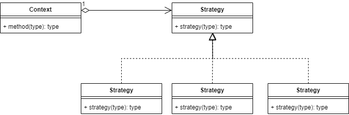
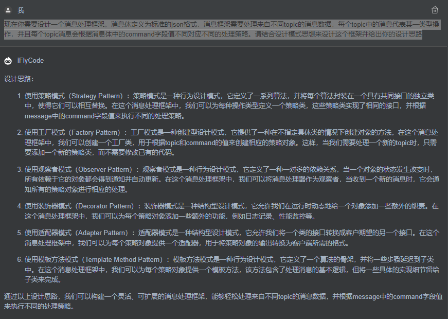

# 设计模式之使用策略模式重构代码
## [设计模式的六大原则](https://www.php.cn/faq/499865.html)
1、单一职责原则，其核心就是控制类的粒度大小、将对象解耦、提高其内聚性；（类和方法，接口）
2、开闭原则，可以通过“抽象约束、封装变化”来实现；（扩展开放，修改关闭）
3、里氏替换原则，主要阐述了有关继承的一些原则；（基类和子类之间的关系）
4、依赖倒置原则，降低了客户与实现模块之间的耦合；（依赖抽象接口，而不是具体对象）
5、接口隔离原则，是为了约束接口、降低类对接口的依赖性；（接口按照功能细分）
6、迪米特法则，要求限制软件实体之间通信的宽度和深度。（类与类之间的亲疏关系）
## 什么是策略模式？为什么要用策略模式？
&ensp; &ensp; 比如说对象的某个行为，在不同场景中有不同的实现方式，这样就可以将这些实现方式定义成一组策略，每个实现类对应一个策略，在不同的场景就使用不同的实现类，并且可以自由切换策略。
策略模式结构图如下：

策略模式需要一个策略接口，不同的策略实现不同的实现类，在具体业务环境中仅持有该策略接口，根据不同的场景使用不同的实现类即可。
面向接口编程，而不是面向实现。
策略模式的优点
1、干掉繁琐的 if、switch 判断逻辑；
2、代码优雅、可复用、可读性好；
3、符合开闭原则，扩展性好、便于维护；
策略模式的缺点：
1、策略如果很多的话，会造成策略类膨胀；
2、使用者必须清楚所有的策略类及其用途；
## 策略模式实战
&ensp; &ensp;需要设计一个消息处理框架。消息体定义为标准的json格式，消息框架需要处理来自不同topic的消息数据，每个topic中的消息代表某一类操作，每个topic消息根据消息体中的command字段值不同对应不同的处理方式。
IFLYcode:
现在你需要设计一个消息处理框架。消息体定义为标准的json格式，消息框架需要处理来自不同topic的消息数据，每个topic中的消息代表某一类型操作，并且每个topic消息会根据消息体中的command字段值不同对应不同的处理策略。请结合设计模式思想来设计这个框架并给出你的设计思路

