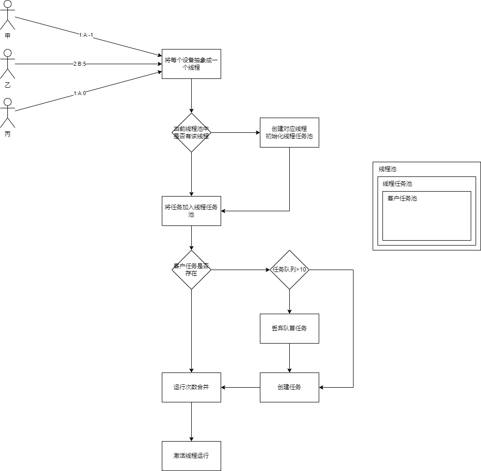
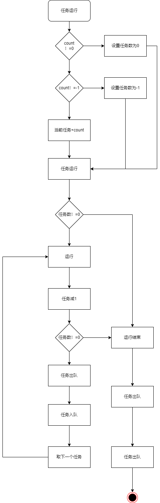

# README
## 需求说明：
甲->1:A:5->甲客户发起1号设备运行A任务，运行5次
-1：无限次
0：停止运行
- 甲发起1A-1任务，任务一直在运行
- 乙发起2B5任务，任务运行5次后停止；
- 丙发起1A0任务，任务直接完成并吧甲任务同时停止
- 每个设备可同时运行10个任务，第十一个任务会把第一个任务剔除；
- 运行过程中可能会不断有任务加入进来运行；
## 任务创建流程

## 线程运行流程

## START
- 启动项目；
- http://127.0.0.1:9001/task/甲/A/10
## 其他情况
- 任务运行过程中，服务被中断/停止/重启，需要继续运行，（任务数据需要持久化到数据库中，并增加定时器检查）