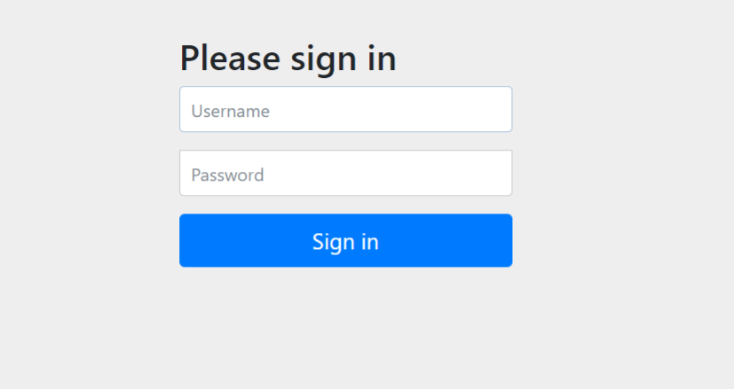
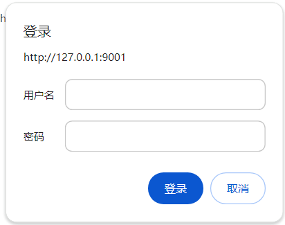

# spring-security学习和使用
## 最干净的spring-security示例
### 依赖
```
<?xml version="1.0" encoding="UTF-8"?>
<project xmlns="http://maven.apache.org/POM/4.0.0" xmlns:xsi="http://www.w3.org/2001/XMLSchema-instance"
         xsi:schemaLocation="http://maven.apache.org/POM/4.0.0 http://maven.apache.org/xsd/maven-4.0.0.xsd">
    <modelVersion>4.0.0</modelVersion>

    <groupId>site.bleem</groupId>
    <artifactId>boot-security</artifactId>
    <version>0.0.1-SNAPSHOT</version>
    <description>Demo project for Spring Boot</description>

    <parent>
        <groupId>site.bleem</groupId>
        <artifactId>spring-boot2</artifactId>
        <version>1.0.0-SNAPSHOT</version>
        <relativePath>../pom.xml</relativePath> <!-- lookup parent from repository -->
    </parent>

    <properties>
        <project.build.sourceEncoding>UTF-8</project.build.sourceEncoding>
        <project.reporting.outputEncoding>UTF-8</project.reporting.outputEncoding>
        <java.version>1.8</java.version>
    </properties>

    <dependencies>

        <dependency>
            <groupId>org.springframework.boot</groupId>
            <artifactId>spring-boot-starter-security</artifactId>
        </dependency>

        <dependency>
            <groupId>org.springframework.boot</groupId>
            <artifactId>spring-boot-starter-web</artifactId>
        </dependency>

    </dependencies>

    <repositories>
        <repository>
            <id>spring-milestones</id>
            <name>Spring Milestones</name>
            <url>https://repo.spring.io/milestone</url>
            <snapshots>
                <enabled>false</enabled>
            </snapshots>
        </repository>
    </repositories>
</project>

```
### 启动类
```
package site.bleem.boot.security;

import org.springframework.boot.SpringApplication;
import org.springframework.boot.autoconfigure.SpringBootApplication;

@SpringBootApplication
public class SecurityApplication {

    public static void main(String[] args) {
        SpringApplication.run(SecurityApplication.class, args);
    }

}
```
### 接口层
```

@RestController
public class SecurityController {
    @GetMapping("/hello/{word}")
    public ResponseEntity<String> returnWorld(@PathVariable("word") String word) {
        return ResponseEntity.ok("hello "+word);
    }

    @GetMapping("/id")
    public ResponseEntity<String> idCode(@RequestParam("idCode") @Validated @NotBlank String idCode) {
        return ResponseEntity.ok("hello "+idCode);
    }
}
```
### 配置文件
```
server:
  port: 9001

spring:
  application:
    name: boot-security

```
### 启动日志
```
  .   ____          _            __ _ _
 /\\ / ___'_ __ _ _(_)_ __  __ _ \ \ \ \
( ( )\___ | '_ | '_| | '_ \/ _` | \ \ \ \
 \\/  ___)| |_)| | | | | || (_| |  ) ) ) )
  '  |____| .__|_| |_|_| |_\__, | / / / /
 =========|_|==============|___/=/_/_/_/
 :: Spring Boot ::        (v2.2.0.RELEASE)

2024-01-10 14:36:46.275  INFO 68732 --- [           main] s.b.boot.security.SecurityApplication    : Starting SecurityApplication on njbestway with PID 68732 (Y:\github\bleem-spring-demo\spring-boot2\boot-security\target\classes started by 南京北路 in Y:\github\bleem-spring-demo\spring-boot2\boot-security)
2024-01-10 14:36:46.534  INFO 68732 --- [           main] s.b.boot.security.SecurityApplication    : No active profile set, falling back to default profiles: default
2024-01-10 14:37:58.292  INFO 68732 --- [           main] o.s.b.w.embedded.tomcat.TomcatWebServer  : Tomcat initialized with port(s): 9001 (http)
2024-01-10 14:37:58.860  INFO 68732 --- [           main] o.apache.catalina.core.StandardService   : Starting service [Tomcat]
2024-01-10 14:37:58.860  INFO 68732 --- [           main] org.apache.catalina.core.StandardEngine  : Starting Servlet engine: [Apache Tomcat/9.0.27]
2024-01-10 14:38:03.884  INFO 68732 --- [           main] o.a.c.c.C.[Tomcat].[localhost].[/]       : Initializing Spring embedded WebApplicationContext
2024-01-10 14:38:03.884  INFO 68732 --- [           main] o.s.web.context.ContextLoader            : Root WebApplicationContext: initialization completed in 73938 ms
2024-01-10 14:38:27.401  INFO 68732 --- [           main] .s.s.UserDetailsServiceAutoConfiguration : 

Using generated security password: d03ba02f-b9c7-4432-a10f-af4df273128c

2024-01-10 14:38:37.439  INFO 68732 --- [           main] o.s.s.web.DefaultSecurityFilterChain     : Will secure any request with [org.springframework.security.web.context.request.async.WebAsyncManagerIntegrationFilter@2e17a321, org.springframework.security.web.context.SecurityContextPersistenceFilter@b112b13, org.springframework.security.web.header.HeaderWriterFilter@4a37191a, org.springframework.security.web.csrf.CsrfFilter@67de7a99, org.springframework.security.web.authentication.logout.LogoutFilter@656922a0, org.springframework.security.web.authentication.UsernamePasswordAuthenticationFilter@244418a, org.springframework.security.web.authentication.ui.DefaultLoginPageGeneratingFilter@1386313f, org.springframework.security.web.authentication.ui.DefaultLogoutPageGeneratingFilter@521bb1a4, org.springframework.security.web.authentication.www.BasicAuthenticationFilter@39909d1a, org.springframework.security.web.savedrequest.RequestCacheAwareFilter@3ac3f6f, org.springframework.security.web.servletapi.SecurityContextHolderAwareRequestFilter@59b65dce, org.springframework.security.web.authentication.AnonymousAuthenticationFilter@35f3a22c, org.springframework.security.web.session.SessionManagementFilter@d5556bf, org.springframework.security.web.access.ExceptionTranslationFilter@1a0d96a5, org.springframework.security.web.access.intercept.FilterSecurityInterceptor@7b81616b]
2024-01-10 14:38:41.688  INFO 68732 --- [           main] o.s.b.w.embedded.tomcat.TomcatWebServer  : Tomcat started on port(s): 9001 (http) with context path ''
2024-01-10 14:38:41.894  INFO 68732 --- [           main] s.b.boot.security.SecurityApplication    : Started SecurityApplication in 152.24 seconds (JVM running for 166.016)
2024-01-10 14:38:47.102  INFO 68732 --- [nio-9001-exec-1] o.a.c.c.C.[Tomcat].[localhost].[/]       : Initializing Spring DispatcherServlet 'dispatcherServlet'
2024-01-10 14:38:47.102  INFO 68732 --- [nio-9001-exec-1] o.s.web.servlet.DispatcherServlet        : Initializing Servlet 'dispatcherServlet'
2024-01-10 14:38:47.102  INFO 68732 --- [nio-9001-exec-1] o.s.web.servlet.DispatcherServlet        : Completed initialization in 0 ms
```
### 使用
#### 默认表单登录行为
1. 启动程序后访问接口：http://127.0.0.1:9001/hello/word，spring security自动被加载启动，由于接口没有权限，自动调整到默认登录页面：
2. 用户名：user(默认) 密码：d03ba02f-b9c7-4432-a10f-af4df273128c（启动日志中自动生成，每次都会变）

#### 使用弹窗登录
1. 定义认证方式适配器；
```
@EnableWebSecurity
//@Configuration
public class WebSecurityConfig extends WebSecurityConfigurerAdapter {

    protected void configure(HttpSecurity http) throws Exception {
        http
                .httpBasic()//使用basic登录
                .and()
                .authorizeRequests()//限制对请求授权
                .anyRequest()//所有请求
                .authenticated();//授权
    }
}
```

2. 页面效果：

#### 自定义用户名密码登录
1. 在WebSecurityConfig中增加密码加密Bean:     
```
    @Bean
    public BCryptPasswordEncoder passwordEncoder() {
        return new BCryptPasswordEncoder();
    }
```
1. 实现UserDetailsService接口，loadUserByUsername方法是根据用户名查询用户数据，在该方法中定义用户匹配逻辑：
```

@Component
public class DefaultUserDetailsService implements UserDetailsService {

    private Logger logger = LoggerFactory.getLogger(getClass());

    @Resource
    private PasswordEncoder passwordEncoder;

    /*
     * (non-Javadoc)
     *
     * @see org.springframework.security.core.userdetails.UserDetailsService#
     * loadUserByUsername(java.lang.String)
     */
    @Override
    public UserDetails loadUserByUsername(String username) throws UsernameNotFoundException {
        logger.info("表单登录用户名:" + username);
        return buildUser(username);
    }

    private UserDetails buildUser(String userId) {
        String password = passwordEncoder.encode("123456");
        logger.info("用户加密密码是:" + password);
        return new User(userId, //用户名
                password,//用户密码
                true, //账户是否可用（用户是否被删）
                true, //账户没有过期
                true, //密码没有过期
                true,//账户没有冻结
                AuthorityUtils.commaSeparatedStringToAuthorityList("admin")//赋予admin权限
        );
    }
}
```

